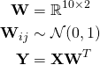
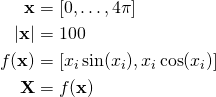
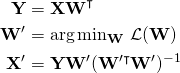
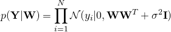
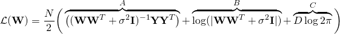
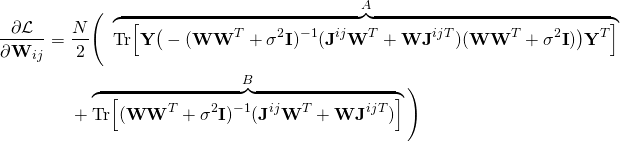
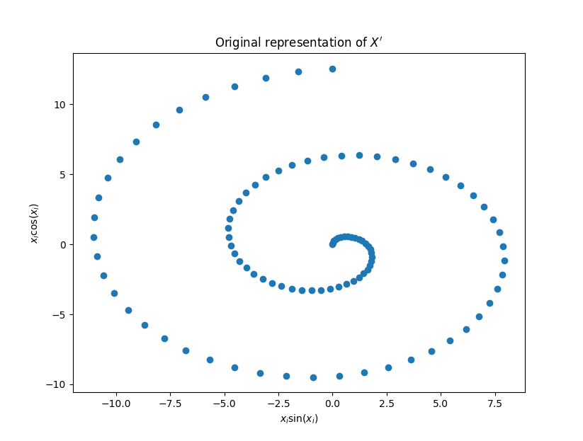
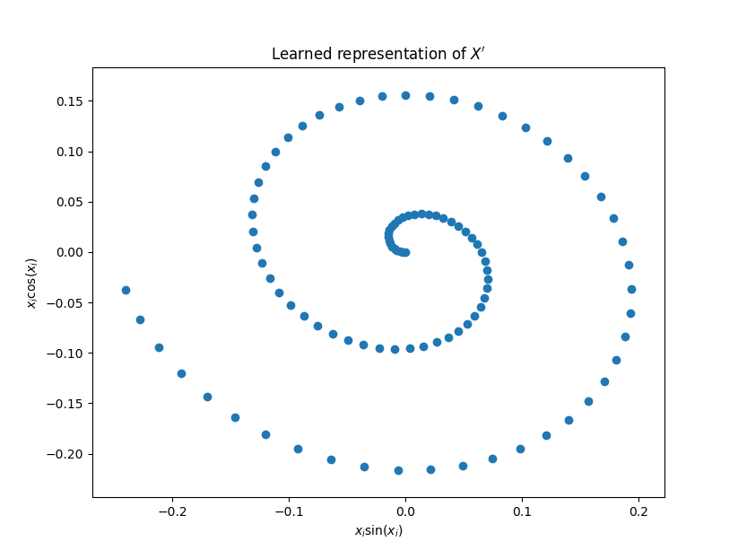
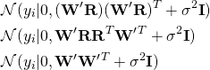

# Representation Learning

Unsupervised learning of the generating parameters of a linear model using
gradient descent.

## Description

We generate data **Y** from our parameters **X** with the following linear
mapping:



Where our parameter **X** is a 100x2 matrix generated as such:



From only the output data **Y** we wish to learn the generating parameter
**X**. We do this by finding the maximum likelihood estimate for W and
reversing the linear mapping. We find the MLE by minimising the negative log
likelihood using gradient descent. The negative log likelihood is our objective
function &#8466;(W).



###  Equations

We use the following equations in our code, the terms are labelled as the
variables are named in python. For an explanation of how I arrived at these
equations please consult `equations.pdf` in this repository:

#### The likelihood



#### The objective function



where D is the number of dimensions.

#### The derivative of the objective function



where **J**&#8305;&#690; is the single entry matrix with 1 at (i, j).

## Results





Our learned representation of **X** is very close to the correct shape, bar a
small transformation of rotation and scale. This is because the marginal
likelihood we are maximising is invariant to any matrix transformation whose
inverse is its own transposition such as a rotation.

We can see this by multiplying **W** in the likelihood by a transformation
**R** such that **RR**&#7488; is the identity matrix:



### Prerequisites

This code relies upon the python packages
* numpy
* matplotlib
* scipy

### Running

To produce the above graphs run:

```
./code.py
```
