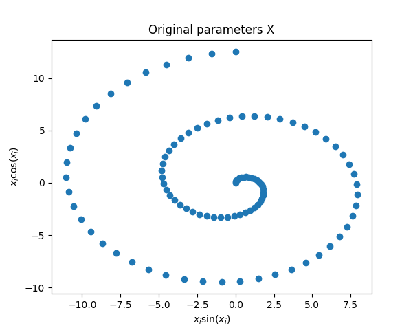

# Representation Learning

Summary

## Description

Description

## Results




### Prerequisites

This code relies upon the python packages
* numpy
* matplotlib
* scipy

### Running

To produce the above graphs run:

```
./code.py
```
