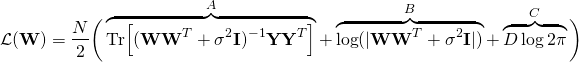
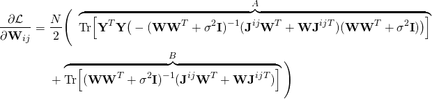
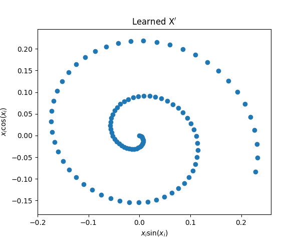

# Representation Learning

Unsupervised learning of the generating parameters of a linear model using
gradient descent.

## Description

We generate data **Y** from our parameters **X** with the following linear
mapping:


Where our parameter **X** is a 100x2 matrix generated as such:


From only the output data **Y** we wish to learn the generating parameter
**X**. We do this by finding the maximum likelihood estimate for W and
reversing the linear mapping. We find the MLE by minimising the negative log
likelihood using gradient descent. The negative log likelihood is our objective
function &#8466;(W).


###  Equations

We use the following equations in our code, the terms are labelled as the
variables are named in python. For derivations of these equations please
consult `derivations.pdf` in this repository:

#### The objective function



#### The derivative of the objective function



## Results




### Prerequisites

This code relies upon the python packages
* numpy
* matplotlib
* scipy

### Running

To produce the above graphs run:

```
./code.py
```
